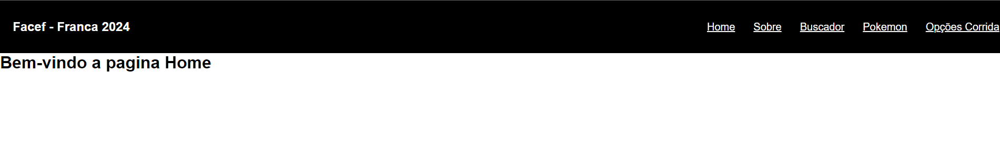
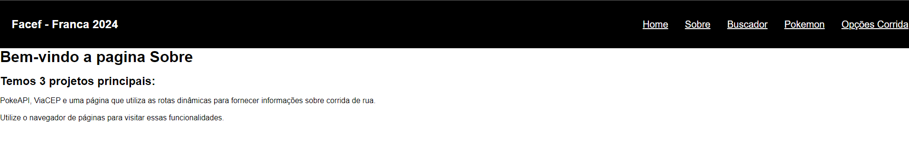
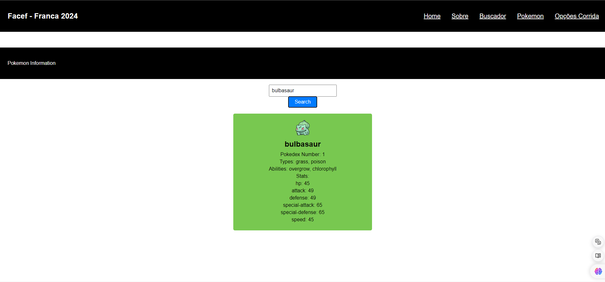
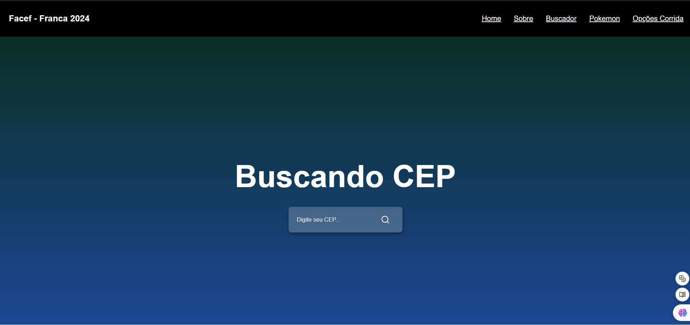
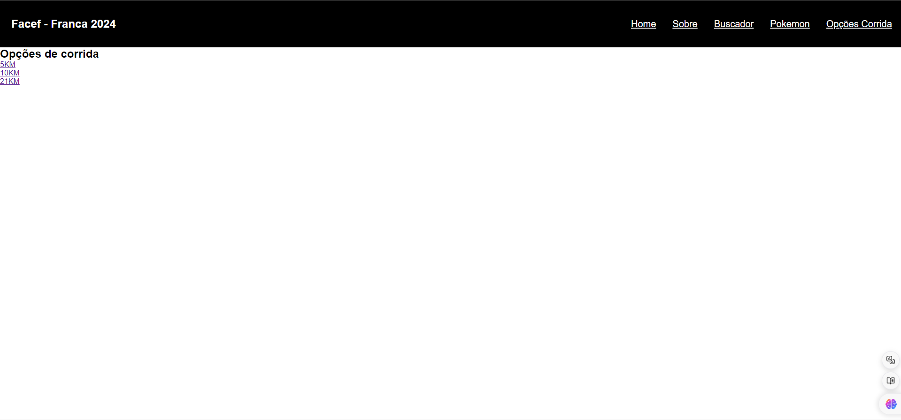
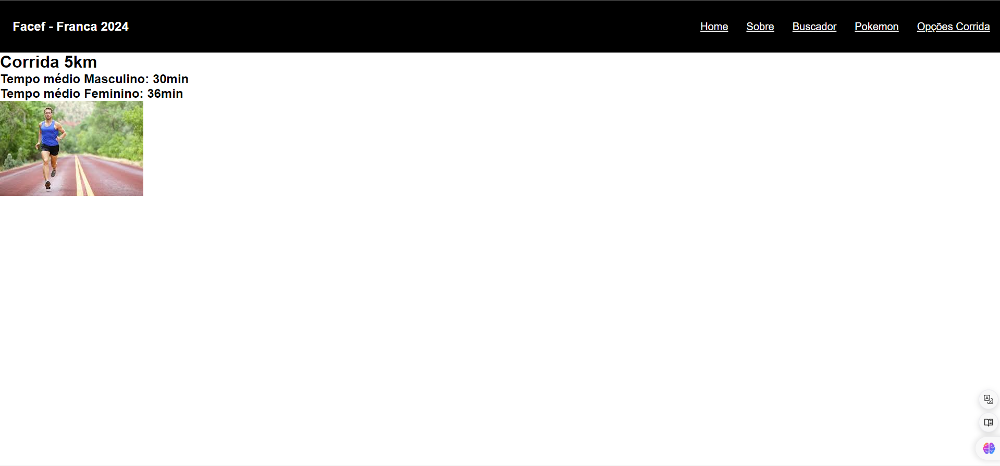
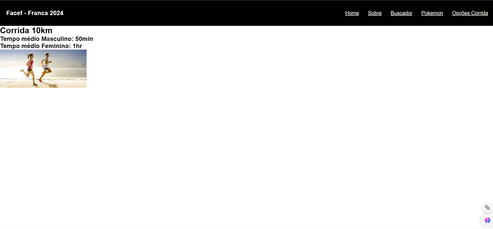
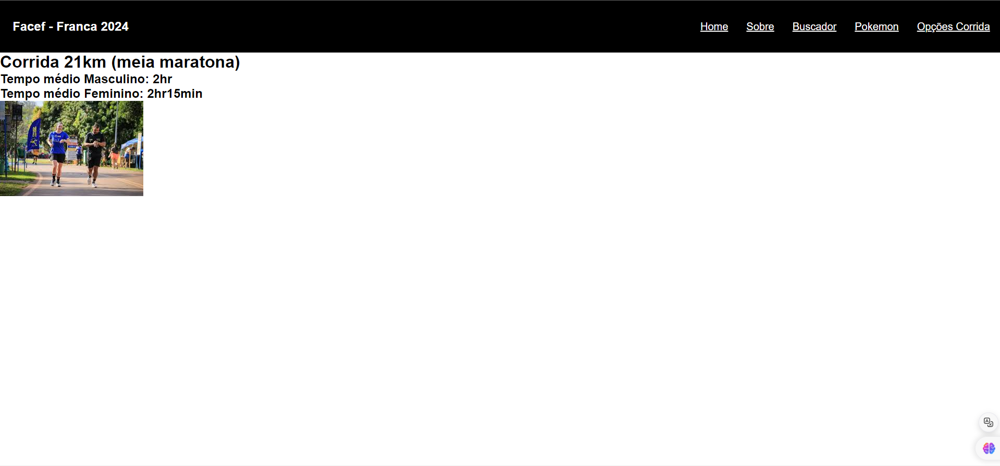

<h1 align="center"> Trabalho de desenvolvimento Web - Unifacef - 5 Semestre </h1>

## Descrição do projeto 

Projeto desenvolvido para a disciplina de desenvolvimento web I na UniFacef.

O sistema é composta por 3 principais projetos. Um projeto sobre Pokemon que faz o uso da PokeAPI(https://pokeapi.co/api/v2/pokemon/), um projeto para busca de CEP que utiliza a API ViaCEP (https://viacep.com.br/), e por fim uma página que utiliza as rotas dinâmicas para fornecer informações sobre diferentes distâncias de corridas de rua.

# Funcionalidades do projeto

- `Funcionalidade 1`: Header que permite a navegação entre as principais funções do site
- `Funcionalidade 2`: Pokedex
- `Funcionalidade 3`: Busca CEP
- `Funcionalidade 4`: Descrição sobre os tempos de diferentes distâncias de corrida de rua (Utilização de rotas dinâmicas)

# 📁 Acesso ao projeto

**Acesso Online**
https://dev-web-3-ano-lmv7.vercel.app/

**Clone o repositório**
- `Passo 1`: Copie a URL do repositório clicando em "Code"
- `Passo 2`: No seu terminal, digite "git clone cole-aqui-a-URL-copiada"
- `Passo 3`: Autentique-se no github caso não esteja utilizando uma chave SSH

# 🛠️ Abrir e rodar o projeto

**Instruções de instalação e execução**
- `Passo 1`: Entre no diretório que o código foi clonado
- `Passo 2`: digite "npm install"
- `Passo 3`: Execute o comando "npm start"
- `Passo 4`: Será aberta uma página em seu browser padrão, com a aplicação que está sendo executada. http://localhost:3000